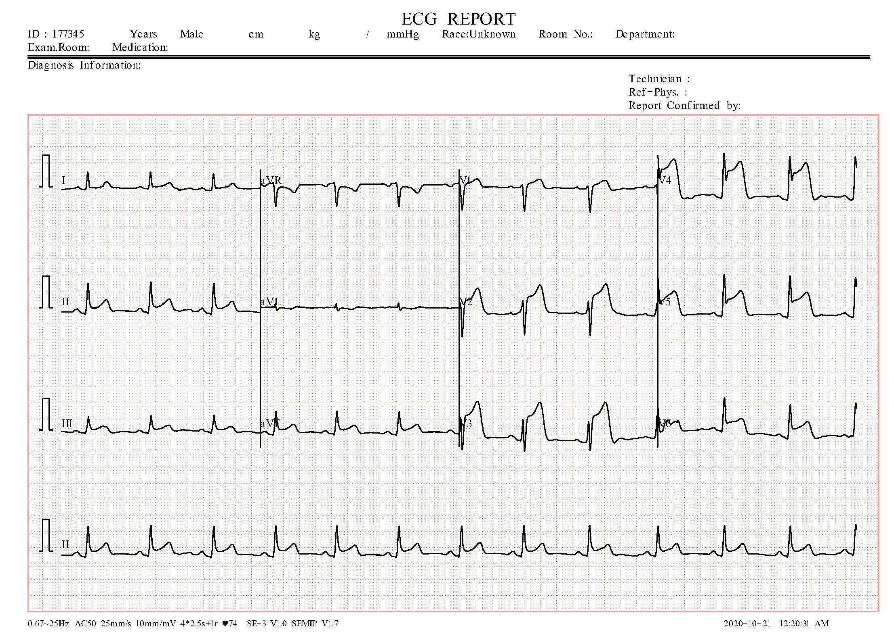
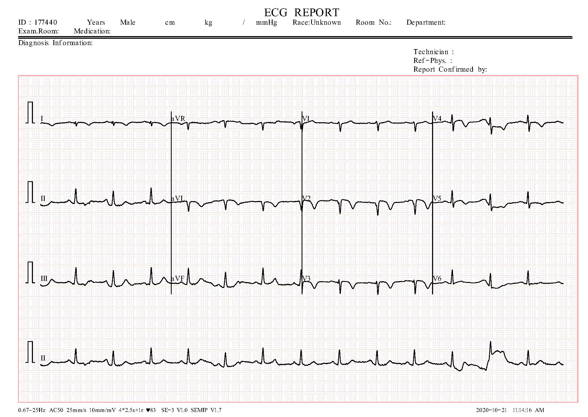
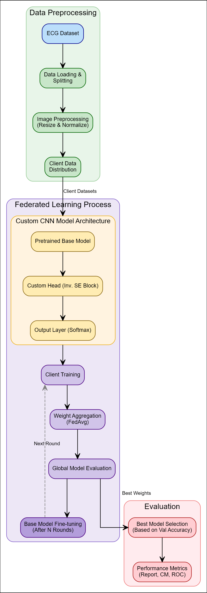
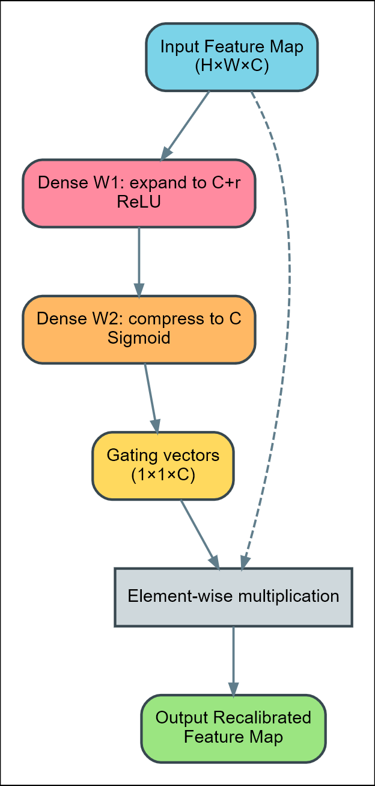

# Federated Transfer Learning for Cardiac Disease Identification using ECG Images

[](https://www.python.org/)
[](https://pytorch.org/)
[](https://ieeexplore.ieee.org/)
[](LICENSE)

> *"A Federated Transfer Learning Framework for Cardiac Disease Identification using ECG Images"*  
> **4th International Conference on Applied Artificial Intelligence and Computing (ICAAIC-2025), IEEE**  
> DOI: [10.1109/ICAAIC64647.2025.11330229](https://doi.org/10.1109/ICAAIC64647.2025.11330229)

---

## Overview

A PyTorch implementation of federated learning for ECG image classification across 4 cardiac conditions. Training is split across 3 simulated clients — each trains a local model on its own data partition and sends only the updated weights to a central server, which aggregates them via FedAvg. No raw data is shared between clients.
The model uses a pre-trained CNN backbone (frozen) for feature extraction, with a small trainable classification head that includes an Inverse Squeeze-and-Excitation (ISE) attention block. Only the head weights are exchanged each round. The best result — ResNet50 backbone + ISE head, trained federatedly — reaches 94.04% validation accuracy on the 4-class ECG dataset.

---

## Dataset

> A. H. Khan, M. Hussain, and M. K. Malik, *"ECG images dataset of cardiac and COVID-19 patients,"* **Data in Brief**, vol. 34, p. 106762, 2021.

**928 images** across **4 classes**:

| Class | Description |
|---|---|
| Normal | Healthy ECG trace |
| Myocardial Infarction | Active MI pattern |
| History of MI | Post-MI trace |
| Abnormal | Other abnormalities |

Sample ECG images from the dataset:

<p align="center">
  
  
</p>
<p align="center"><em>Left: Normal ECG &nbsp;|&nbsp; Right: Myocardial Infarction ECG</em></p>

Download from [Mendeley Data](https://data.mendeley.com/datasets/gwbz3fsgp8/2) and place in `ECG_DATA/` with one sub-folder per class.

---

## Architecture

### Full Pipeline

The overall pipeline — from data preprocessing through federated training to evaluation:

<p align="center">
  
</p>
<p align="center"><em>Fig. Model Architecture </em></p>

The flow is:
1. ECG images are loaded, resized, and normalised; then distributed equally across **3 clients**
2. Each client holds a frozen pre-trained CNN backbone + a trainable custom head (ISE block)
3. Clients train locally for **3 epochs per round**; only head weights are sent to the server
4. The server aggregates via **FedAvg** and broadcasts updated weights back
5. This repeats for **100 communication rounds**; the checkpoint with the best validation accuracy is kept

### Inverse Squeeze-and-Excitation (ISE) Block

Unlike the standard SE block (compress → expand), ISE **expands first, then squeezes**, producing richer inter-feature attention:

<p align="center">
  
</p>
<p align="center"><em>Fig. ISE Block </em></p>

### Classification Head

```
Backbone features
    │
Linear(num_ftrs → 256) + ReLU
    │
ISE Block (256 → 256×ratio → 256)
    │
Dropout(0.3)
    │
Linear(256 → 4)  →  Softmax
```

---

## Results

### Performance Metrics

| Model | Accuracy (%) | Recall (%) | F1-Score (%) |
|---|:---:|:---:|:---:|
| MobileNetV3-Small | 85.41 | 85.00 | 85.50 |
| ResNet50V2 | 88.11 | 88.50 | 88.00 |
| **Fed MobileNetV3-Small + ISE** | **91.62** | 91.80 | 91.90 |
| **Fed ResNet50V2 + ISE** | **94.04** | **94.40** | **94.30** |

---

## Setup

```bash
git clone https://github.com/<your-username>/federated-ecg-classification.git
cd federated-ecg-classification
pip install -r requirements.txt
```

---

## Usage

Set your paths and backbone in `train.py`:

```python
config = {
    "DATASET_PATH"   : "ECG_DATA",          # root folder of the dataset
    "BASE_OUTPUT_DIR": "results",            # output folder
    "BASE_MODEL_NAME": "resnet50",           # or mobilenet_v3_small, efficientnet_b0, densenet121
    ...
}
```

Then run:

```bash
python train.py
```

Each fold writes to `results/fold_<n>/`:

| File | Contents |
|---|---|
| `best_<model>_federated.pth` | Best checkpoint (highest val accuracy) |
| `training_history.png` | Loss & accuracy over rounds |
| `confusion_matrix.png` | Per-class confusion matrix |
| `roc_curves.png` | One-vs-Rest ROC curves with AUC |
| `classification_report.txt` | Precision / Recall / F1 per class |

A cross-validation summary is saved to `results/kfold_summary.txt`.

---

## Key Hyperparameters

| Parameter | Default | Description |
|---|---|---|
| `NUM_ROUNDS` | 100 | Federated communication rounds |
| `NUM_CLIENTS` | 3 | Simulated institutions |
| `CLIENT_EPOCHS` | 3 | Local epochs per round |
| `INITIAL_LEARNING_RATE` | 0.001 | Adam LR (head only) |
| `L2_REG` | 1e-5 | L2 weight decay |
| `SE_RATIO` | 16 | ISE expansion ratio |
| `K_FOLDS` | 4 | Stratified cross-validation folds |
| `BATCH_SIZE` | 32 | Mini-batch size |

---

## Citation

```bibtex
@inproceedings{sivasenthil2025ftl,
  title     = {A Federated Transfer Learning Framework for Cardiac Disease
               Identification using {ECG} Images},
  author    = {Siva Senthil Manikkam, R and Damodaran, B and
               Rokamwar, Sairaj and Abdul Gaffar, H},
  booktitle = {Proceedings of the 4th International Conference on Applied
               Artificial Intelligence and Computing (ICAAIC)},
  pages     = {1887--1892},
  year      = {2025},
  publisher = {IEEE},
  doi       = {10.1109/ICAAIC64647.2025.11330229}
}
```

---

## License

MIT — see [LICENSE](LICENSE) for details.
